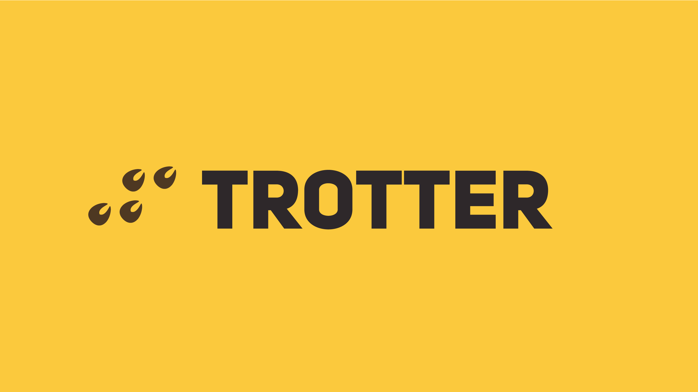

# Trotter

  

## Description

 Trotter is a discord bot I made for some incredibly simple moderation, along with a few helpful commands.

## Installation

To run this project, you'll need [Git](https://git-scm.com/downloads), [Docker](https://docs.docker.com/install/), and [Docker Compose](https://docs.docker.com/compose/install/).

You will also need a [Discord Developer](https://discordapp.com/developers) account with an application and bot setup.

### Linux

#### Clone

    $ git clone https://github.com/MattJarman/trotter-bot.git
    $ cd trotter-bot/
    
#### Setup
> Copy the env example to new env file

    $ cp .env.sample .env

> Open the env file you just created with a text editor and insert the your Discord bot token and Steam API key

    $ vim .env
    TOKEN=YOUR_DISCORD_BOT_TOKEN_HERE
    STEAM_API_KEY=YOUR_STEAM_API_KEY_HERE
    ...
 
 > Run the `start.sh` script in the project root
 
    $ ./start.sh
    
 > To stop the application, run the `stop.sh` script
 
     $ ./stop.sh
